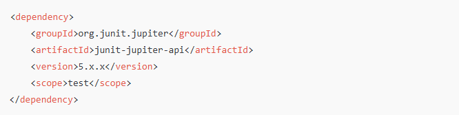

# Tutorial JUnit

## Introdução ao JUnit:

### O que é o JUnit e por que usá-lo.

  O JUnit é uma das principais bibliotecas de framework de teste para a linguagem Java, amplamente utilizada para a criação e execução de testes automatizados. Ele ajuda os desenvolvedores a escrever e executar testes unitários, que são pequenos trechos de código projetados para verificar se partes específicas do código (geralmente métodos ou classes) funcionam conforme esperado.

- Por que usar o JUnit:

  1. Verificação de Código: Ajuda a garantir que as funcionalidades do código estejam corretas e que não haja regressões quando novas alterações são feitas.
  2. Automação de Testes: Automatiza a execução dos testes, economizando tempo e reduzindo o trabalho manual.
  3. Integração Contínua: Facilita a integração com ferramentas de CI/CD, permitindo que os testes sejam executados automaticamente durante o processo de construção do software.
  4. Melhoria na Qualidade do Código: Incentiva práticas de programação orientadas a testes, promovendo um código mais robusto, manutenível e com menos erros.
  5. Feedback Rápido: Fornece um retorno imediato sobre a funcionalidade e a estabilidade do código.

- Como funciona:

Com o JUnit, os testes são escritos como métodos em uma classe de teste, onde você pode usar anotações como @Test para indicar que o método deve ser executado como um teste. Com comandos como assertEquals(), assertTrue(), e outros, você verifica se o resultado obtido corresponde ao esperado.
  
### Arquitetura e principais componentes do JUnit.

  A arquitetura do JUnit é composta por um conjunto de componentes que facilitam a escrita, execução e organização de testes. Com a evolução da biblioteca, desde suas versões iniciais até a atual (JUnit 5), a arquitetura tem se tornado mais modular e flexível. A seguir, explico a estrutura e os principais componentes do JUnit:

- Arquitetura do JUnit:

O JUnit, especialmente na versão JUnit 5 (também conhecido como JUnit Jupiter), é dividido em três subprojetos principais:

1. JUnit Platform: A plataforma subjacente que fornece a base para o lançamento e execução dos testes. Ela permite que diferentes frameworks de teste sejam executados de forma integrada e define a API para inicializadores e descobridores de testes.
2. JUnit Jupiter: O módulo que traz a nova API de testes e a implementação dos testes. É a parte que contém as novas anotações e métodos de testes usados na escrita de testes unitários.
3. JUnit Vintage: Um componente que permite a execução de testes escritos nas versões anteriores (JUnit 3 e 4), garantindo a compatibilidade retroativa.

- Principais Componentes e Conceitos:
1. Anotações: O JUnit utiliza anotações para definir o comportamento dos métodos de teste. As mais comuns incluem:

   * @Test: Indica que o método é um teste.
   * @BeforeEach e @AfterEach: Executam métodos antes e depois de cada método de teste.
   * @BeforeAll e @AfterAll: Executam métodos uma única vez antes e depois de todos os testes da classe (devem ser métodos static).
   * @Disabled: Desativa um teste específico temporariamente.
   * @RepeatedTest: Executa um teste repetidamente.
   * @ParameterizedTest: Permite a execução de um mesmo teste com diferentes parâmetros.
    
2. Assertions: Utilizados para validar resultados. A biblioteca fornece métodos como:
 
   * assertEquals(expected, actual): Verifica se os valores esperados e atuais são iguais.
   * assertTrue(condition): Verifica se a condição é verdadeira.
   * assertFalse(condition): Verifica se a condição é falsa.
   * assertNotNull(object): Verifica se o objeto não é null.
   * assertThrows(exceptionClass, executable): Verifica se uma exceção é lançada conforme esperado.
  
3. Extensões: O JUnit 5 possui um sistema de extensões que permite adicionar funcionalidades, como controle de tempo de execução, manipulação de contexto, e integração com outras bibliotecas. Isso é feito usando a anotação @ExtendWith.

4. Test Lifecycle: O ciclo de vida dos testes é controlado pelas anotações mencionadas, permitindo a configuração e liberação de recursos de forma controlada, como inicializar objetos antes de cada teste ou liberar memória após os testes.

- Integração com Ferramentas de Build:

O JUnit pode ser facilmente integrado com ferramentas de construção de projetos como Maven e Gradle, permitindo que os testes sejam executados automaticamente em fases específicas do ciclo de vida de construção do projeto.

- Benefícios da Arquitetura Modular do JUnit 5:

  * Flexibilidade: A separação em módulos permite o uso de componentes independentes e facilita a extensão do JUnit.
  * Compatibilidade: O JUnit Vintage permite que projetos legados ainda possam executar testes antigos enquanto migram para JUnit 5.
  * Suporte a extensões: Com um sistema de extensões poderoso, é possível adaptar o JUnit para uma variedade de casos de uso, como integração com bases de dados ou sistemas de mocking.
  
### Histórico do JUnit (JUnit 3, 4 e 5).

O JUnit tem uma longa trajetória de evolução desde suas versões iniciais até a atual, cada uma trazendo mudanças importantes em suas funcionalidades e arquitetura. Aqui está um resumo do histórico do JUnit desde o JUnit 3 até o JUnit 5:

- JUnit 3:

  * Lançamento: Anos 1990.
  * Criadores: Kent Beck e Erich Gamma, dois pioneiros no desenvolvimento de práticas de teste em desenvolvimento de software e metodologias como Extreme Programming (XP).
  * Características principais:
    
      1. Introduziu a estrutura básica de testes unitários, incluindo o conceito de fixtures (configuração inicial antes dos testes).
      2. Métodos de teste precisavam ser nomeados explicitamente com o prefixo test (por exemplo, testSoma).
      3. Usava a classe TestCase como classe base, da qual as classes de teste herdavam.
   
   * Limitações: Não utilizava anotações, o que tornava a estrutura de código um pouco mais rígida e menos intuitiva.
 
- JUnit 4:

  * Lançamento: 2006.
  * Principais mudanças:
 
      1. Introdução de anotações: A maior mudança em relação ao JUnit 3 foi o uso de anotações para marcar métodos de teste e gerenciar o ciclo de vida dos testes. Algumas das anotações introduzidas foram:
         * @Test para marcar métodos como testes.
         * @Before e @After para definir métodos executados antes e depois de cada teste.
         * @BeforeClass e @AfterClass para métodos executados uma vez antes e depois de todos os testes da classe.
           
      3. Melhoria de assertivas: Adição de novos métodos de verificação e melhorias nas assertivas existentes.
      4. Flexibilidade com regras e categorias: Permitiu maior controle sobre o ambiente de teste e a execução de grupos de testes.
   
  * Requisitos: Utilizava Java 5 ou superior devido ao uso extensivo de anotações.
  * Limitações:
      1. O projeto era monolítico e algumas funcionalidades, como a execução de testes parametrizados, eram mais complexas de usar.
   
- JUnit 5 (também conhecido como JUnit Jupiter):
  * Lançamento: 2017.
  * Principais mudanças e avanços:
    1. Arquitetura modular: Dividido em três subprojetos principais:
       * JUnit Platform: Base para a execução de testes e integração com outras bibliotecas de teste.
       * JUnit Jupiter: Nova API e implementação para escrever testes.
       * JUnit Vintage: Compatibilidade para executar testes escritos nas versões anteriores (JUnit 3 e 4).
         
    3. Novas anotações:
       * @BeforeEach e @AfterEach substituíram @Before e @After.
       * @BeforeAll e @AfterAll substituíram @BeforeClass e @AfterClass, com a exigência de que fossem static.
       * Introdução de @DisplayName para descrever testes de forma mais legível.
       * Adição de @Nested para criar testes aninhados e melhorar a organização.
         
    5. Extensibilidade: Novo mecanismo de extensões que substituiu o antigo sistema de regras, permitindo personalizações como injeção de dependências e tratamento de exceções.
    6. Suporte a testes parametrizados: Simplificou a execução de testes com diferentes parâmetros usando @ParameterizedTest.
    7. API de assertivas melhorada: Mais métodos de assertivas e uma API mais rica para manipulação de condições.
       
  * Vantagens:
    1. Modularidade: Capacidade de usar componentes de forma independente.
    2. Compatibilidade com Java 8+: Utilização de recursos modernos do Java, como lambdas e streams.
    3. Compatibilidade retroativa: Possibilidade de executar testes antigos usando o módulo Vintage.
  
## Estrutura Básica de Testes:

A estrutura básica de testes usando JUnit, que é um framework de teste para aplicações Java, envolve a criação de classes de teste que validam funcionalidades individuais do código. A seguir, estão os componentes principais de uma estrutura de testes usando JUnit:

- Configuração do Ambiente
  * Dependências: Para usar o JUnit, é necessário incluir as dependências do JUnit no projeto. Se estiver usando Maven, por exemplo:
 
    

    
### Criando uma classe de testes no JUnit.
### Anotações principais: @Test, @BeforeEach, @AfterEach, @BeforeAll, @AfterAll.
### Assertivas: assertEquals(), assertNotNull(), assertTrue(), etc.
  
## Anotações do JUnit 5:
### @Test: Definindo métodos de teste.
### @BeforeEach e @AfterEach: Inicializando e limpando antes e depois de cada teste.
### @BeforeAll e @AfterAll: Inicialização e limpeza de uma vez para toda a classe de teste.
### @Disabled: Desabilitando um teste.
### @ParameterizedTest e @ValueSource: Para testes com parâmetros.
  
## Testes Parametrizados:
### Como usar o @ParameterizedTest para rodar o mesmo teste com diferentes valores.
### Tipos de fontes de dados: @ValueSource, @EnumSource, @MethodSource.
  
## Exceções e Erros:
### Testando exceções com assertThrows().
### Verificando mensagens de erro.
  
## Testes de Performance:
### Como realizar testes de tempo de execução com @Test e medir o tempo com assertTimeout().
  
## Mocks e Stubs:
### Utilizando frameworks como Mockito para criar mocks e stubs em seus testes JUnit.
### Como testar interações com dependências externas.
  
## Estratégias de Teste:
### Testes unitários vs Testes de integração.
### Cobertura de código e boas práticas em testes.
### TDD (Test-Driven Development): Como aplicar em seu fluxo de trabalho.
  
## Execução de Testes e Relatórios:
### Como executar os testes em IDEs como IntelliJ, Eclipse, ou via linha de comando.
### Gerando relatórios de execução de testes.

## Testando o Código Assíncrono e Concorrente:
### Estratégias para testar código assíncrono e threads usando JUnit.
